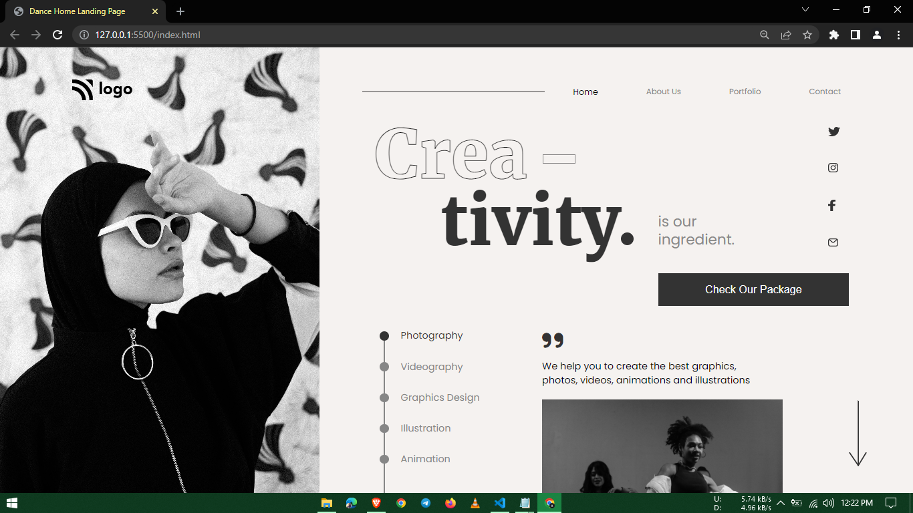

# 14-Dance-landing-page
It is part of the Full Stack Javascript Bootcamp being taught at ineuron.ai by Hitesh Choudhary Sir.

## Project  [Live Link]()

-   During this project, I gained the following skills:
    -   I learned about relative & absolute.
    -   I learned to use **text-stroke-width** to create outline text effect.
---

## Time taken to finish this project

-   4 hour to complete it.

#### Screenshot

